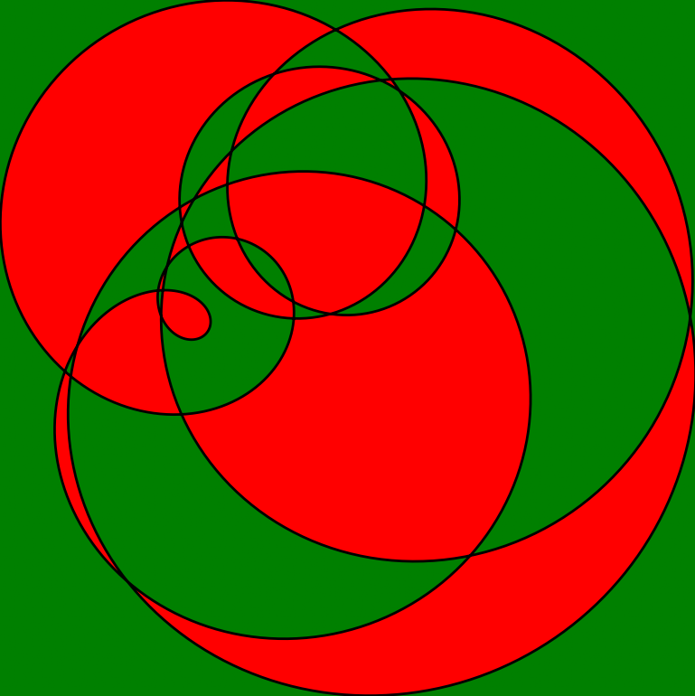

# epicycles-plot

A Python script to generate and visualize epicycles—beautiful mathematical curves—using random parameters. The script creates high-resolution images and highlights regions based on the winding number with respect to the epicycle curve. All configuration is handled via JSON files for full reproducibility and transparency.

## Features
- Generates random epicycle curves of configurable order
- Saves images in high resolution (default: 1000x1000 px)
- Colors regions based on the winding number (odd: red, even: green)
- All parameters are set via JSON input files (no code editing required)
- Every run produces a JSON output file with all config and calculated values for perfect reproducibility
- Robust logging to `logs/epicycles_plot.log` (overwritten each run)
- Command line options for input, verbose logging, and help
- **Extensive error handling and validation** for all input/output and file operations

## Mathematical Background
Epicycles are curves generated by the sum of several rotating circles (Fourier series). Historically, epicycles were used in astronomy to model planetary orbits. Mathematically, an epicycle of order $n$ can be described as:

$$
\begin{align*}
x(t) &= \sum_{k=1}^n r_k \cos(f_k t + \phi_k) \\
y(t) &= \sum_{k=1}^n r_k \sin(f_k t + \phi_k)
\end{align*}
$$

where:
- $r_k$ = radius of the $k$-th circle
- $f_k$ = frequency (number of rotations)
- $\phi_k$ = phase offset
- $t$ = parameter (angle)

The script also computes the **winding number** for each pixel: the number of times the curve winds around that point. Pixels with an odd winding number are colored with `ODD_COLOR`, pixels with an even winding number are colored with `EVEN_COLOR`.

## Installation

1. **Clone the repository:**
   ```bash
   git clone https://github.com/yourusername/epicycles-plot.git
   cd epicycles-plot
   ```
2. **Create and activate a virtual environment:**
   ```bash
   python3 -m venv venv
   source venv/bin/activate
   ```
3. **Install the requirements:**
   ```bash
   pip install -r requirements.txt
   ```

## Usage

### Basic usage
```bash
python epicycles_plot.py
```
This uses the default configuration from `default-input.json`.

### Custom input file
```bash
python epicycles_plot.py -jsoninput myparams.json
```

### Reproduce a previous run
```bash
python epicycles_plot.py -jsoninput output/epicycle_YYYYMMDD_HHMMSS.json
```

### Verbose logging
```bash
python epicycles_plot.py -v
```

### Help
```bash
python epicycles_plot.py -h
```

## JSON Input/Output Format

### Input JSON
The script expects a JSON file with the following fields in the root or under a `config` key:

```
{
  "N_TERMS": 6,                // (int) Number of epicycles (order, >=1)
  "DURATION": 6.28318530718,   // (float) Total parameter range (usually 2*pi for a full cycle)
  "POINTS": 1000,              // (int) Number of points for the curve (higher = smoother)
  "SAVE_DIR": "output",        // (str) Directory for output files
  "RADIUS_RANGE": [20, 120],   // (list of 2 floats) Min/max radius for random epicycles
  "FREQ_RANGE": [1, 10],       // (list of 2 ints) Min/max frequency for random epicycles
  "PHASE_RANGE": [0, 6.2831],  // (list of 2 floats) Min/max phase (in radians, usually 0 to 2*pi)
  "IMG_WIDTH": 1000,           // (int) Image width in pixels
  "IMG_HEIGHT": 1000,          // (int) Image height in pixels
  "BG_COLOR": "white",         // (str or RGB tuple) Background color (e.g. 'white', '#000000', [1,1,1])
  "CURVE_COLOR": "black",      // (str or RGB tuple) Color of the epicycle curve
  "ODD_COLOR": "red",          // (str or RGB tuple) Color for odd winding number regions
  "EVEN_COLOR": "green",       // (str or RGB tuple) Color for even winding number regions
  "RANDOM_SEED": null          // (int or null) Optional: set for reproducible randomness
}
```

#### Parameter explanations
- **N_TERMS**: Number of epicycles (order). Higher = more complex curves. Must be >= 1 (integer).
- **DURATION**: Range for parameter t. Use $2\pi$ for a full cycle. Larger values = more windings. (float, >0)
- **POINTS**: Number of points to sample the curve. Higher = smoother, but slower. Must be >=2 (integer).
- **SAVE_DIR**: Output directory for images and JSON files. (string, must be writable)
- **RADIUS_RANGE**: Range for random radii of each epicycle. Both values >= 0, [min, max]. (list of two floats)
- **FREQ_RANGE**: Range for random integer frequencies. Both values >= 1, [min, max]. (list of two ints)
- **PHASE_RANGE**: Range for random phase offsets (in radians). Usually [0, 2*pi]. (list of two floats)
- **IMG_WIDTH/IMG_HEIGHT**: Output image size in pixels. Must be >=10 (integers).
- **BG_COLOR**: Background color. Can be a color name, hex string, or RGB tuple/list.
- **CURVE_COLOR**: Color of the epicycle curve. Same format as BG_COLOR.
- **ODD_COLOR**: Color for regions with odd winding number. Same format as BG_COLOR.
- **EVEN_COLOR**: Color for regions with even winding number. Same format as BG_COLOR.
- **RANDOM_SEED**: Optional integer for reproducible randomness. Use null for random each run.

**All parameters are type-checked and validated.** If a parameter is missing, of the wrong type, or out of range, the script will log an error and abort.

### Output JSON
After each run, a JSON file is written to the output directory with the same basename as the image, containing:
- The full config used (`config`)
- All calculated values (`calculated`) needed to exactly reproduce the image

You can use this output JSON as input to reproduce the exact same image:
```bash
python epicycles_plot.py -jsoninput output/epicycle_YYYYMMDD_HHMMSS.json
```

### Example input JSON
See `default-input.json` in this repository for a ready-to-use example.

## Logging
- All steps, errors, and results are logged to `logs/epicycles_plot.log` (overwritten each run).
- Use `-v` or `--verbose` to also print log entries to the screen.
- Errors and missing/invalid parameters are logged and shown to the user.
- Log format is compatible with log analyzers.
- **All file and calculation errors are logged with details.**

## Error Handling
- The script checks for the existence, readability, and validity of the input JSON before running.
- All parameters are type-checked and validated for allowed ranges and types.
- Output directories and files are checked for writability; errors are logged and abort the script.
- All exceptions are logged with details and the script exits with a clear message and exit code.
- If an error occurs, the script exits with a clear message and log entry.

## Example Output Files

The script generates PNG and JSON output files in the `output/` directory. Each run creates a pair of files with the same basename (timestamped), e.g.:

- `output/epicycle_YYYYMMDD_HHMMSS.png`  (the generated image)
- `output/epicycle_YYYYMMDD_HHMMSS.json` (all parameters and calculated values)

You can open any PNG file in the `output/` folder to view the result, and use the corresponding JSON file as input to reproduce the exact same image:

```bash
python epicycles_plot.py -jsoninput output/epicycle_YYYYMMDD_HHMMSS.json
```

> **Tip:** Replace `YYYYMMDD_HHMMSS` with the actual timestamp of the file you want to use. The PNG and JSON must have the same basename.

---

### Output Example
- Image: `output/epicycle_20250727_144132.png`
- JSON:  `output/epicycle_20250727_144132.json`



## License
GNU Public License

## Acknowledgements
- Uses [matplotlib](https://matplotlib.org/) and [numpy](https://numpy.org/)
- Mathematical background: [Epicycles on Wikipedia](https://en.wikipedia.org/wiki/Epicycle)
